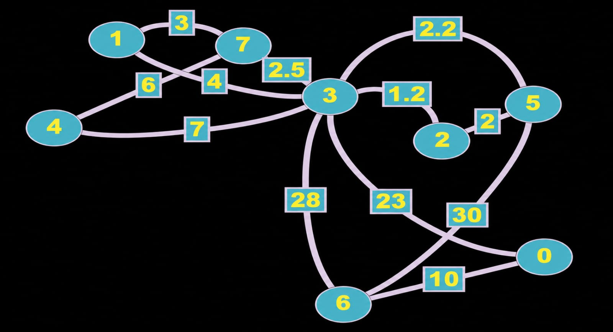

# 🇯🇴 Amman City Network Optimization

##  Overview
This project applies advanced graph algorithms to model and optimize a transportation/routing network between major landmarks in Amman, Jordan. Built with **C++**, the project demonstrates practical applications of Graph Theory, specifically focusing on shortest path calculations and network cost minimization.

##  Key Features & Algorithms
*   **Breadth-First Search (BFS):** Implemented to traverse and explore the city's network level by level.
*   **Dijkstra’s Algorithm:** Utilized to calculate the exact shortest path from a given source to various landmarks, ensuring optimal routing based on distance.
*   **Prim’s Algorithm (MST):** Applied to find the Minimum Spanning Tree, optimizing the overall network connection cost, resulting in a minimum total distance of **47.7 km** for the mapped landmarks.

##  Tech Stack
*   **Language:** C++
*   **Data Structures:** Adjacency Matrix, Priority Queues (`std::priority_queue`), Standard Queues (`std::queue`), Vectors.
*   **Concepts:** Graph Theory, Time Complexity Optimization $O(V^2 \log V)$, Greedy Algorithms.

##  Network Graph Map


##  How to Run
1. Clone the repository:
   ```bash
   git clone https://github.com/MotazAlgawagneh/Amman-City-Network-Optimization.git
   ```

2. Compile the C++ source code using any standard compiler (e.g., g++):
   ```bash
   g++ Source-Code.cpp -o NetworkOptimizer
   ```
   
3. Run the executable:
   ```bash
   ./NetworkOptimizer
   ```  
